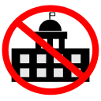

# Reddit Politics Blocker

U.S. Politics posts from the election season until now have been mentally exhausting. The Reddit Politics Blocker extension will ease your mind by hiding all US politics posts from Reddit.

Currently this extension only works with the old Reddit UI. We have two versions, the Reddit Politics Blocker (with the Reddit Redirector built-in) and the Reddit Politics Blocker Lite (with just politics blocking capabilities). 

## Download
### Reddit Politics Blocker (with built in redirecter) <em>(Under Development. To be released soon)</em>
### [Reddit Politics Blocker Lite](https://chrome.google.com/webstore/detail/reddit-politics-blocker-l/hfamlllggifbgmknfmfjcbmgiakngeaj)

## Instructions

1. To use Reddit Politics Blocker, install the extension and you're good to go. Currently under development for publishing.

2. To use Reddit Politics Blocker Lite:
    - Install the Extension
    - Enable Old Reddit. Either:
        - (If logged in to Reddit) either enable legacy mode in [preferences](https://old.reddit.com/r/help/comments/8f2n7d/how_do_i_permanently_go_back_to_old_reddit/), or,
        - Use an old.reddit.com redirecter (such as [Old Reddit Redirect](https://chrome.google.com/webstore/detail/old-reddit-redirect/dneaehbmnbhcippjikoajpoabadpodje)).

Please report any issues here in the [issues tab](https://github.com/RedditPoliticsBlocker/RedditPoliticsBlockerExtension/issues) until we can register a subreddit.
